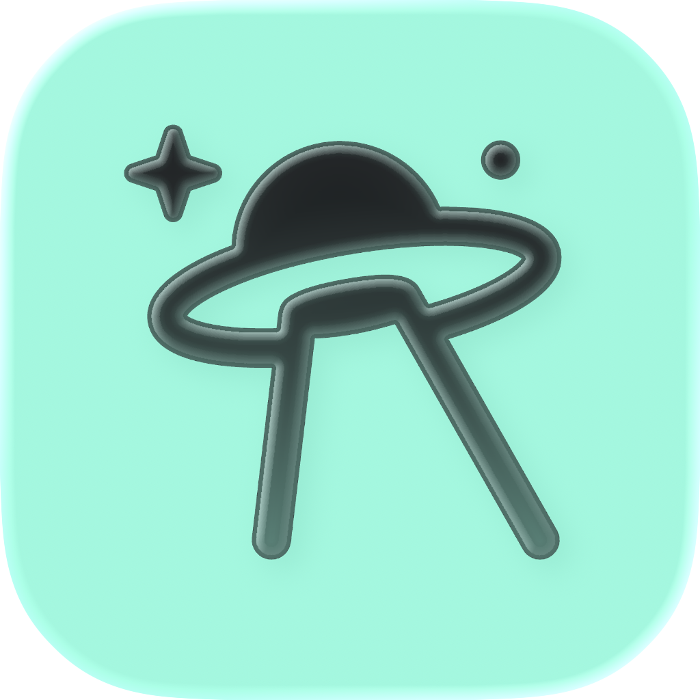

<p align="center">
  
</p>

<h1 align="center">Ross</h1>

<p align="center">
  <strong>A beautiful desktop GUI for <a href="https://github.com/openai/codex">Codex</a></strong>
</p>

<p align="center">
  
  
  
  
  
  
  
</p>

<p align="center">
  Wraps <code>codex app-server</code> in a polished Electron app with streaming chat,<br/>
  command approvals, project context, and local voice transcription.
</p>

---

## Highlights

- **Streaming chat UI** — real-time token streaming for Codex turns
- **Command approval flows** — review and approve shell commands and file changes before they execute
- **Project picker** — switch between projects and reference files from the chat
- **Skills browser** — discover and invoke Codex skills
- **Git integration** — status, diffs, and commit helpers built-in
- **Voice input** — fully local transcription via `ffmpeg` + `whisper.cpp`

## Architecture

```
Renderer (React 19 + Zustand + Tailwind v4)
  → preload (contextBridge)
    → ipcMain handlers
      → CodexServer
        → codex app-server (JSON-RPC over stdio)
```

Three-process Electron app built with `electron-vite`. The renderer sends typed calls through `window.codex.*`, the main process manages a `CodexServer` child process, and streaming events flow back through IPC.

## Prerequisites

Ross is **not** a standalone Codex distribution. You need:

| Requirement | Purpose |
|---|---|
| `pnpm` | Package manager |
| `codex` CLI on `PATH` | Spawns `codex app-server` |
| `codex login` | Creates `~/.codex/auth.json` |

**Optional** (for voice input):

| Tool | Purpose |
|---|---|
| `ffmpeg` | Audio conversion |
| `whisper.cpp` | Local speech-to-text |
| GGML Whisper model | Transcription model file |

## Getting started

```bash
pnpm install
pnpm dev
```

1. Run `codex login` if you haven't authenticated yet.
2. Start Ross.
3. Open a project and begin a thread.

## Build

```bash
pnpm lint          # ESLint
pnpm typecheck     # Full typecheck (main + renderer)
pnpm build         # Typecheck + production build
```

Platform packages:

```bash
pnpm build:mac          # macOS
pnpm build:mac:release  # macOS (notarized)
pnpm build:win          # Windows
pnpm build:linux        # Linux
```

> Ross is developed primarily on macOS. Linux and Windows targets are included but should be validated locally before release.

## Local voice transcription

Voice transcription runs entirely on-device.

```bash
# macOS
brew install ffmpeg whisper-cpp
mkdir -p ~/.cache/whisper
curl -L https://huggingface.co/ggerganov/whisper.cpp/resolve/main/ggml-base.en.bin \
  -o ~/.cache/whisper/ggml-base.en.bin
```

If the model lives elsewhere:

```bash
export WHISPER_MODEL_PATH=/absolute/path/to/ggml-base.en.bin
```

| Environment Variable | Description |
|---|---|
| `WHISPER_MODEL_PATH` | Path to GGML model file |
| `WHISPER_COMMAND` | Custom whisper binary |
| `FFMPEG_COMMAND` | Custom ffmpeg binary |
| `WHISPER_LANGUAGE` | Transcription language |

## Project structure

```
src/
├── main/          Electron main process & Codex integration
├── preload/       Secure bridge (window.codex)
└── renderer/src/  React renderer
build/             Packaging assets
resources/         App icons
docs/              Architecture & integration docs
```

## Contributing

See [CONTRIBUTING.md](./CONTRIBUTING.md) for setup, checks, and PR expectations.

## Security

See [SECURITY.md](./SECURITY.md) for private vulnerability reporting.

## License

Ross is released under the [Ross Non-Resale Source License 1.0](./LICENSE).
You can use, modify, and share the code, but commercial resale, white-label
distribution, and paid hosted offerings require written permission from
Sami Hindi at [sami@samihindi.com](mailto:sami@samihindi.com).

This is source-available, not OSI-approved open source.
